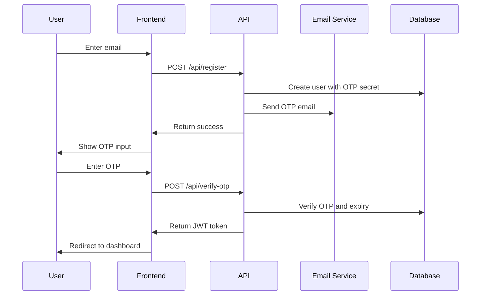

# Architecture Document: Mentorship & Job Board Platform MVP

## 1. Executive Summary

This document outlines the technical architecture for the Mentorship & Job Board Platform MVP, designed to connect healthcare/education professionals with career opportunities and mentorship. The platform serves three primary user roles: Mentees, Mentors, and Admins, with a focus on secure authentication, opportunity management, and administrative oversight.

## 2. System Overview

### 2.1 Architecture Pattern
- **Full-Stack Next.js Application** with Server-Side Rendering (SSR)
- **API-First Design** with Next.js API routes
- **Database-First Approach** with Prisma ORM
- **Component-Based UI** with Shadcn UI and Tailwind CSS

### 2.2 Technology Stack

#### Frontend
- **Framework**: Next.js 15.4.1 (React 19.1.0)
- **Styling**: Tailwind CSS + Shadcn UI components
- **State Management**: React Hook Form + Zod validation
- **Animations**: Framer Motion
- **Charts**: Recharts for analytics

#### Backend
- **Runtime**: Next.js API routes (Node.js)
- **Database**: MongoDB with Prisma ORM
- **Authentication**: Custom email OTP system
- **File Storage**: AWS S3
- **Email Service**: Brevo (Sendinblue)

#### Infrastructure
- **Hosting**: Vercel (primary), AWS (backup)
- **Security**: JWT tokens, encrypted storage
- **Monitoring**: Built-in Next.js analytics

## 3. Database Architecture

### 3.1 Schema Design

The database follows a normalized design with clear entity relationships:

#### Core Entities

**User Model**
```typescript
- id: ObjectId (Primary Key)
- email: String (Unique)
- firstName, lastName: String
- role: Role (MENTEE | MENTOR | ADMIN)
- otpSecret, otpExpiry: String, DateTime
- termsAccepted: Boolean
- deletedAt: DateTime (Soft delete)
- timestamps: createdAt, updatedAt
```

**Profile Model** (One-to-One with User)
```typescript
- userId: ObjectId (Foreign Key)
- Common fields: bio, location, avatar, resume
- Mentee fields: education, interests, purposeOfRegistration
- Mentor fields: specialty, subSpecialty, workplace, availabilityStatus, yearsOfExperience
```

**Opportunity Model** (Unified for both Mentors and Mentees)
```typescript
- id: ObjectId (Primary Key)
- title, description: String
- location, experienceLevel: String
- opportunityTypeId: ObjectId (Foreign Key)
- creatorId: ObjectId (Foreign Key to User)
- creatorRole: Role (MENTOR | MENTEE)
- sourceUrl, sourceName: String (for external opportunities)
- requirements, benefits, duration, compensation: String
- applicationDeadline: DateTime
- status: OpportunityStatus (PENDING | APPROVED | REJECTED | EXPIRED)
- adminFeedback, adminNotes: String
- timestamps: createdAt, updatedAt, deletedAt
```

### 3.2 Key Design Decisions

1. **Unified Opportunity Model**: Both mentors and mentees can create opportunities, distinguished by `creatorRole`
2. **Soft Deletes**: Implemented for User and Opportunity models to maintain data integrity
3. **Audit Trail**: Comprehensive AuditLog model for compliance and debugging
4. **Flexible Profile System**: Single Profile model with role-specific fields
5. **Discussion System**: Separate models for threads and comments with categorization

### 3.3 Indexing Strategy

```typescript
// Performance indexes
@@index([action]) // AuditLog
@@index([entityType]) // AuditLog
@@index([userId]) // AuditLog
@@index([createdAt]) // AuditLog

// Unique constraints
@@unique([menteeId, opportunityId]) // Application
@@unique([userId, opportunityId]) // SavedOpportunity
```

## 4. Authentication & Security Architecture

### 4.1 Authentication Flow



### 4.2 Security Implementation

#### JWT Token Management
- **Token Structure**: User ID, role, expiration
- **Storage**: HTTP-only cookies
- **Refresh**: Automatic token refresh on API calls
- **Expiration**: 24-hour tokens with refresh capability

#### OTP Security
- **Generation**: Cryptographically secure random OTP
- **Expiration**: 10-minute window
- **Rate Limiting**: Maximum 3 attempts per email per hour
- **Storage**: Encrypted in database

#### Data Protection
- **Sensitive Data**: Encrypted at rest
- **File Uploads**: Signed URLs for S3 access
- **Input Validation**: Zod schemas for all API endpoints
- **SQL Injection**: Prevented by Prisma ORM

## 5. API Architecture

### 5.1 Route Structure

```
/api/
├── auth/
│   ├── register
│   ├── login
│   ├── verify-otp
│   ├── resend-otp
│   └── logout
├── user/
│   └── [id]
├── profile/
│   ├── GET (current user)
│   └── PUT (update)
├── opportunities/
│   ├── GET (list with filters)
│   ├── POST (create)
│   ├── [id]/GET
│   ├── [id]/PUT
│   └── [id]/DELETE
├── applications/
│   ├── GET (user's applications)
│   ├── POST (apply)
│   └── [id]/PUT (update status)
├── saved-opportunities/
│   ├── GET (user's saved)
│   ├── POST (save)
│   └── DELETE (unsave)
├── discussions/
│   ├── GET (list)
│   ├── POST (create thread)
│   └── [id]/comments
├── admin/
│   ├── users (approval management)
│   ├── opportunities (moderation)
│   ├── analytics
│   └── audit-logs
├── upload/
│   └── POST (file upload to S3)
└── download/
    └── GET (secure file download)
```

### 5.2 API Design Principles

1. **RESTful Design**: Standard HTTP methods and status codes
2. **Consistent Response Format**: Standardized error and success responses
3. **Input Validation**: Zod schemas for all endpoints
4. **Error Handling**: Comprehensive error logging and user-friendly messages
5. **Rate Limiting**: API rate limiting for security
6. **CORS**: Proper CORS configuration for cross-origin requests

## 6. Frontend Architecture

### 6.1 Component Structure

```
src/
├── app/ (Next.js App Router)
│   ├── (auth)/ (route groups)
│   │   ├── login/
│   │   ├── register/
│   │   └── verify/
│   ├── dashboard/
│   │   ├── mentee/
│   │   ├── mentor/
│   │   └── admin/
│   ├── opportunities/
│   ├── applications/
│   ├── discussions/
│   ├── profile/
│   └── api/
├── components/
│   ├── ui/ (Shadcn UI components)
│   ├── forms/ (Form components)
│   ├── layout/ (Layout components)
│   └── features/ (Feature-specific components)
├── lib/
│   ├── auth.ts
│   ├── db.ts
│   ├── utils.ts
│   └── validations.ts
└── hooks/
    ├── useAuth.ts
    ├── useOpportunities.ts
    └── useApplications.ts
```

### 6.2 State Management Strategy

1. **Server State**: React Query for API data caching
2. **Form State**: React Hook Form with Zod validation
3. **UI State**: React useState for local component state
4. **Global State**: Context API for auth and user data

### 6.3 Responsive Design

- **Mobile-First**: Tailwind CSS responsive utilities
- **Breakpoints**: sm (640px), md (768px), lg (1024px), xl (1280px)
- **Touch-Friendly**: Proper touch targets and gestures
- **Progressive Enhancement**: Core functionality works without JavaScript

## 7. File Storage Architecture

### 7.1 AWS S3 Integration

#### File Types
- **Resumes**: PDF, DOC, DOCX (max 10MB)
- **Avatars**: JPG, PNG, WebP (max 5MB)
- **Other Documents**: PDF, DOC, DOCX (max 10MB)

#### Security Measures
- **Signed URLs**: Time-limited access to files
- **Bucket Policies**: Restrictive access controls
- **File Validation**: Server-side file type and size validation
- **Virus Scanning**: Integration with AWS GuardDuty (future)

#### Storage Structure
```
s3://urocareerz-bucket/
├── resumes/
│   └── {userId}/{timestamp}-{filename}
├── avatars/
│   └── {userId}/{timestamp}-{filename}
└── temp/
    └── {sessionId}/{filename}
```

## 8. Email Notification System

### 8.1 Brevo Integration

#### Email Templates
1. **OTP Verification**: Account creation and login
2. **Application Notifications**: Application submitted, status updates
3. **Opportunity Alerts**: New opportunities, deadline reminders
4. **Admin Notifications**: User approval, content moderation
5. **System Announcements**: Platform updates, maintenance

#### Email Flow
```typescript
interface EmailTemplate {
  templateId: string;
  variables: Record<string, any>;
  to: string[];
  subject: string;
}
```

### 8.2 Notification Triggers

1. **User Registration**: OTP email
2. **Application Submission**: Notification to mentor
3. **Application Status Change**: Notification to mentee
4. **Opportunity Approval**: Notification to creator
5. **Admin Actions**: Audit trail emails

## 9. Admin & Moderation System

### 9.1 Admin Dashboard Features

#### User Management
- **User Approval**: Manual approval of new registrations
- **Role Management**: Assign/change user roles
- **User Analytics**: Registration trends, active users

#### Content Moderation
- **Opportunity Review**: Approve/reject opportunity posts
- **Content Flagging**: Handle inappropriate content
- **Bulk Actions**: Mass approve/reject operations

#### Analytics & Reporting
- **User Metrics**: Registration, engagement, retention
- **Content Metrics**: Posts, applications, discussions
- **Audit Logs**: Complete action history

### 9.2 Audit System

#### Audit Log Structure
```typescript
interface AuditLog {
  action: string;        // CREATE, UPDATE, DELETE, APPROVE, etc.
  entityType: string;    // USER, OPPORTUNITY, APPLICATION, etc.
  entityId: string;      // ID of affected entity
  userId: string;        // User performing action
  metadata: object;      // Additional context
  ipAddress: string;     // Security tracking
  userAgent: string;     // Browser/client info
  timestamp: Date;
}
```

## 10. Performance & Scalability

### 10.1 Performance Optimizations

#### Database
- **Indexing**: Strategic indexes on frequently queried fields
- **Pagination**: Efficient pagination for large datasets
- **Query Optimization**: Prisma query optimization

#### Frontend
- **Code Splitting**: Dynamic imports for route-based splitting
- **Image Optimization**: Next.js Image component with WebP
- **Caching**: Static generation where possible
- **Bundle Optimization**: Tree shaking and minification

#### API
- **Response Caching**: Cache frequently accessed data
- **Rate Limiting**: Prevent API abuse
- **Compression**: Gzip compression for responses

### 10.2 Scalability Considerations

#### Horizontal Scaling
- **Stateless Design**: No server-side state dependencies
- **Database Scaling**: MongoDB Atlas for managed scaling
- **CDN**: Vercel Edge Network for global distribution

#### Vertical Scaling
- **Resource Monitoring**: Track CPU, memory, database connections
- **Performance Metrics**: Response times, error rates
- **Capacity Planning**: Monitor growth trends

## 11. Security & Compliance

### 11.1 GDPR Compliance

#### Data Protection
- **Data Minimization**: Only collect necessary data
- **Consent Management**: Clear terms and privacy policy
- **Right to Erasure**: Soft delete with data retention policies
- **Data Portability**: Export user data on request

#### Security Measures
- **Encryption**: Data encrypted at rest and in transit
- **Access Controls**: Role-based access control (RBAC)
- **Session Management**: Secure session handling
- **Input Sanitization**: Prevent XSS and injection attacks

### 11.2 Security Headers

```typescript
// Next.js security headers
const securityHeaders = [
  {
    key: 'X-DNS-Prefetch-Control',
    value: 'on'
  },
  {
    key: 'Strict-Transport-Security',
    value: 'max-age=63072000; includeSubDomains; preload'
  },
  {
    key: 'X-XSS-Protection',
    value: '1; mode=block'
  },
  {
    key: 'X-Frame-Options',
    value: 'DENY'
  },
  {
    key: 'X-Content-Type-Options',
    value: 'nosniff'
  }
];
```

## 12. Deployment & DevOps

### 12.1 Deployment Strategy

#### Production Environment
- **Platform**: Vercel (primary), AWS (backup)
- **Database**: MongoDB Atlas
- **File Storage**: AWS S3
- **Email**: Brevo
- **Monitoring**: Vercel Analytics + custom logging

#### CI/CD Pipeline
```yaml
# GitHub Actions workflow
name: Deploy
on:
  push:
    branches: [main]
jobs:
  deploy:
    runs-on: ubuntu-latest
    steps:
      - uses: actions/checkout@v3
      - uses: actions/setup-node@v3
      - run: npm ci
      - run: npm run build
      - run: npm run lint
      - uses: amondnet/vercel-action@v25
```

### 12.2 Environment Management

#### Environment Variables
```bash
# Database
DATABASE_URL=mongodb+srv://...

# Authentication
JWT_SECRET=...
OTP_SECRET=...

# AWS
AWS_ACCESS_KEY_ID=...
AWS_SECRET_ACCESS_KEY=...
AWS_REGION=...
S3_BUCKET_NAME=...

# Email
BREVO_API_KEY=...

# Application
NEXTAUTH_URL=...
NEXTAUTH_SECRET=...
```

## 13. Monitoring & Observability

### 13.1 Application Monitoring

#### Performance Metrics
- **Response Times**: API endpoint performance
- **Error Rates**: 4xx and 5xx error tracking
- **User Experience**: Core Web Vitals
- **Database Performance**: Query execution times

#### Business Metrics
- **User Engagement**: Daily/Monthly Active Users
- **Content Metrics**: Opportunities posted, applications submitted
- **Conversion Rates**: Registration to profile completion
- **Retention**: User return rates

### 13.2 Logging Strategy

#### Log Levels
- **ERROR**: Application errors and exceptions
- **WARN**: Warning conditions
- **INFO**: General application flow
- **DEBUG**: Detailed debugging information

#### Log Structure
```typescript
interface LogEntry {
  timestamp: string;
  level: 'error' | 'warn' | 'info' | 'debug';
  message: string;
  userId?: string;
  sessionId?: string;
  metadata?: object;
}
```

## 14. Future Considerations

### 14.1 Scalability Enhancements

#### Technical Improvements
- **Real-time Features**: WebSocket integration for live updates
- **Advanced Search**: Elasticsearch for complex queries
- **Caching Layer**: Redis for session and data caching
- **Microservices**: Service decomposition for scale

#### Feature Enhancements
- **Social Login**: Google, LinkedIn integration
- **Calendar Integration**: Mentor availability scheduling
- **Video Calls**: Integration with Zoom/Teams APIs
- **Mobile App**: React Native or Flutter application

### 14.2 Business Growth

#### Monetization Features
- **Premium Subscriptions**: Enhanced features for paid users
- **Featured Listings**: Promoted opportunities
- **Analytics Dashboard**: Advanced insights for organizations
- **API Access**: Third-party integrations

#### Platform Expansion
- **Multi-language Support**: Internationalization
- **Organization Profiles**: Company/institution pages
- **Advanced Matching**: AI-powered mentor-mentee matching
- **Certification System**: Verified credentials and badges

## 15. Risk Assessment & Mitigation

### 15.1 Technical Risks

#### Database Performance
- **Risk**: MongoDB performance degradation with growth
- **Mitigation**: Proper indexing, query optimization, monitoring

#### Security Vulnerabilities
- **Risk**: Data breaches, unauthorized access
- **Mitigation**: Regular security audits, penetration testing

#### Scalability Issues
- **Risk**: System unable to handle user growth
- **Mitigation**: Performance monitoring, capacity planning

### 15.2 Business Risks

#### User Adoption
- **Risk**: Low user engagement and retention
- **Mitigation**: User feedback loops, iterative improvements

#### Regulatory Compliance
- **Risk**: GDPR violations, legal issues
- **Mitigation**: Legal review, compliance monitoring

#### Competition
- **Risk**: Market competition affecting growth
- **Mitigation**: Unique value proposition, feature differentiation

## 16. Conclusion

This architecture provides a solid foundation for the Mentorship & Job Board Platform MVP, with clear separation of concerns, scalable design patterns, and comprehensive security measures. The technology choices align with modern best practices while maintaining simplicity for rapid development and deployment.

The modular design allows for incremental feature development and easy maintenance, while the comprehensive monitoring and logging ensure operational visibility. The architecture is designed to scale with business growth while maintaining performance and security standards.

---

**Document Version**: 1.0  
**Last Updated**: December 2024  
**Next Review**: January 2025 